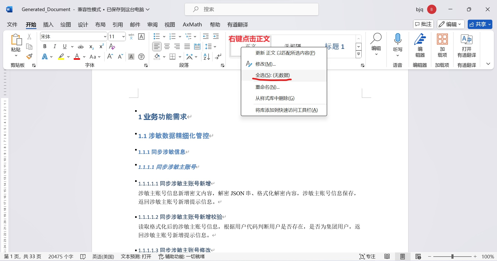

# Excel to word  

## Data
数据需要预处理成data文件夹中工作簿1的样子（仅把COSMIC功能点拆分表中的一级模块、二级模块、三级模块、触发事件、子过程描述 整列复制，存为工作簿1）。

## Code
请运行exceltoword_final.py

### Path路径
excel_path = './data/工作簿1.xlsx'\
直接改文件名字就行，前面不用改，用的是相对路径。但是要在data文件夹下。

### 整体Title和起始数字
section_title = "业务功能需求"\
section_number = "1"  # Changeable\
用来改起始数字。

### 文档字体
全文文档字体为中文宋体、英文Times New Roman。

### 存储Path
word_path = './data/Generated_Document.docx'\
最终存储在data文件夹下，名称为Generated_Document.docx

### 首行缩进
请直接在word里操作:)

全选正文后选择段落，首行缩进2字符。
